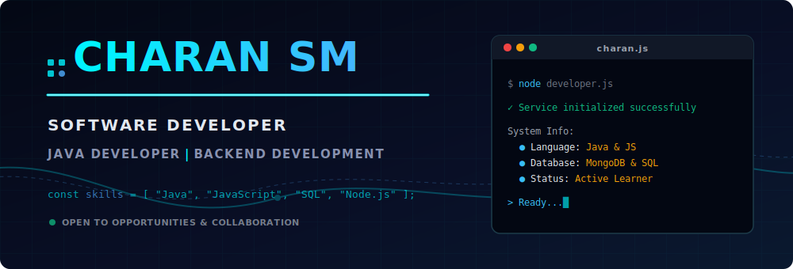

<div align="center">
  <!-- 1. Premium SVG Banner -->
  
  
  <br/><br/>
  
  <!-- 2. My Name -->
  <h1>Charan SM</h1>
  
  <!-- 3. Animated Typing -->
  
  
  <br/><br/>
  
  <!-- 4. Social Buttons -->
  <a href="https://www.linkedin.com/in/charan-sm-720b61295/" target="_blank">
    
  </a>
  <a href="mailto:charansm2005@gmail.com">
    
  </a>
  <a href="https://github.com/charan-sm07" target="_blank">
    
  </a>
  
  <br/><br/>
  
  <!-- 5. Visitor Counter -->
  
</div>

<!-- 
  FIRST SCREEN ISOLATION 
  Using multiple breaks to ensure the hero section fills the viewport,
  giving a clean, immersive premium entry.
-->
<br/><br/><br/><br/><br/><br/><br/><br/><br/><br/>
<hr />
<br/><br/>

## 💻 About Me

```javascript
const charan = {
  pronouns: "he/him",
  education: "4th-Year B.Tech in Information Technology",
  coreFocus: "Backend Development & AI Agent Integration",
  passion: ["Data Structures & Algorithms", "Building Scalable Systems"],
  funFact: "I analyze EKG-style wait-times to optimize hospital scheduling agents"
};
```

<br/>

## 🛠️ Technical Tech Stack

<table width="100%">
  <tr>
    <td valign="top" width="50%">
      <strong>💻 Languages</strong><br/>
      <a href="https://skillicons.dev"></a>
    </td>
    <td valign="top" width="50%">
      <strong>⚙️ Backend &amp; Database</strong><br/>
      <a href="https://skillicons.dev"></a>
    </td>
  </tr>
  <tr>
    <td valign="top" width="50%">
      <strong>🔧 Tools &amp; Platforms</strong><br/>
      <a href="https://skillicons.dev"></a>
    </td>
    <td valign="top" width="50%">
      <strong>🚀 Currently Learning</strong><br/>
      <a href="https://skillicons.dev"></a>
    </td>
  </tr>
</table>

<br/>

## 🚀 Featured Projects

<table width="100%">
  <!-- Project 1 -->
  <tr>
    <td>
      <table width="100%" border="0" cellspacing="0" cellpadding="10" style="background-color: #0d1117; border: 1px solid #30363d; border-radius: 8px;">
        <tr>
          <td>
            <h3 style="margin-top: 0;">🏥 MediSlot AI — Hospital Appointment Scheduling Agent</h3>
            <p>An intelligent clinical scheduler designed with a multi-layered verification pipeline (Security Scorer → NLP Slot Extraction → RAG Policy Checks → Decision Heuristics) and a clean "Calm Clinical" frontend dashboard.</p>
            <p><strong>Tech Stack:</strong> Node.js, Express.js, MongoDB, JavaScript</p>
            <p>
              <a href="https://github.com/charan-sm07/AI-Powered-Hospital-Appointment-Scheduling-Agent" target="_blank">
                
              </a>
              <a href="https://ai-powered-hospital-appointment-sch.vercel.app" target="_blank">
                
              </a>
            </p>
            
          </td>
        </tr>
      </table>
    </td>
  </tr>
  
  <!-- Spacer row -->
  <tr><td><br/></td></tr>

  <!-- Project 2 -->
  <tr>
    <td>
      <table width="100%" border="0" cellspacing="0" cellpadding="10" style="background-color: #0d1117; border: 1px solid #30363d; border-radius: 8px;">
        <tr>
          <td>
            <h3 style="margin-top: 0;">🔎 FindIt AI — Smart AI Lost &amp; Found System</h3>
            <p>A full-stack hackathon project designed to match reported lost or found items. Uses a custom Jaccard Similarity AI engine to calculate match confidence scores and detail match reasons.</p>
            <p><strong>Tech Stack:</strong> Node.js, Express.js, MongoDB, JavaScript, CSS</p>
            <p>
              <a href="https://github.com/charan-sm07/smart-ai-lost-found-system" target="_blank">
                
              </a>
            </p>
            
          </td>
        </tr>
      </table>
    </td>
  </tr>

  <!-- Spacer row -->
  <tr><td><br/></td></tr>

  <!-- Project 3 -->
  <tr>
    <td>
      <table width="100%" border="0" cellspacing="0" cellpadding="10" style="background-color: #0d1117; border: 1px solid #30363d; border-radius: 8px;">
        <tr>
          <td>
            <h3 style="margin-top: 0;">🐍 Retro Snake Game</h3>
            <p>A classic and responsive browser-based arcade snake game with smooth frame pacing, keyboard controls, dynamic food sizing, score trackers, and CSS themes.</p>
            <p><strong>Tech Stack:</strong> HTML5, CSS3, JavaScript</p>
            <p>
              <a href="https://github.com/charan-sm07/Snake-game" target="_blank">
                
              </a>
            </p>
          </td>
        </tr>
      </table>
    </td>
  </tr>
</table>

<br/>

## 🏆 Problem Solving & DSA Repositories

I regularly practice data structures and algorithms to sharpen my programming logic:
*   🟢 **GeeksforGeeks Practice**: [GreekforGeeks-solutions](https://github.com/charan-sm07/GreekforGeeks-solutions) — Algorithm study notes and challenge solutions.
*   🔵 **NeetCode Problems**: [neetcode-problems](https://github.com/charan-sm07/neetcode-problems) — Solutions to curated DSA problems.
*   🔴 **HackerEarth Solutions**: [hackerearth-solutions](https://github.com/charan-sm07/hackerearth-solutions) — Algorithm practice scripts.

<br/>

## 📈 GitHub Analytics & Stats

<table width="100%">
  <!-- Stats and Top Languages -->
  <tr>
    <td valign="top" width="50%">
      
    </td>
    <td valign="top" width="50%">
      
    </td>
  </tr>
  
  <!-- Streak Stats Card -->
  <tr>
    <td colspan="2">
      <br/>
      
    </td>
  </tr>

  <!-- Contribution Graph Chart -->
  <tr>
    <td colspan="2">
      <br/>
      <strong>📊 Contribution Chart</strong>
      <br/><br/>
      
    </td>
  </tr>
</table>

<br/>

## 🎮 Snake Contribution Grid Game

<picture>
  <source media="(prefers-color-scheme: dark)" srcset="https://raw.githubusercontent.com/charan-sm07/charan-sm07/output/github-contribution-grid-snake-dark.svg" />
  <source media="(prefers-color-scheme: light)" srcset="https://raw.githubusercontent.com/charan-sm07/charan-sm07/output/github-contribution-grid-snake.svg" />
  
</picture>

<br/><br/>

<!-- Premium Waving Footer Wave -->

